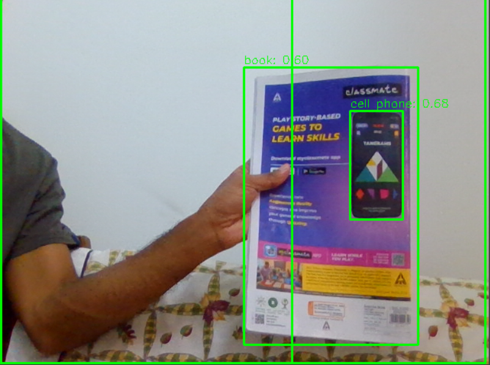

# Object Detection Project

# Camera OFF
Press Key Q

## Overview
This project demonstrates object detection using machine learning techniques. It identifies and classifies objects within images or video streams.

## Features
- Detects multiple objects in real-time.
- Supports various pre-trained models (e.g., YOLO, SSD, Faster R-CNN).
- Easy-to-use interface for testing and visualization.

## Requirements
- Python 3.7 or higher
- Required libraries:
    - OpenCV
    - TensorFlow or PyTorch
    - ultralytics>=8.0.100

Install dependencies using:
```bash
pip install -r requirements.txt
```

## Usage
1. Clone the repository:
     ```bash
     git clone https://github.com/your-repo/object-detection.git
     cd object-detection
     ```
2. Run the detection script:
     ```bash
     python detect.py --input <input_file> --model <model_name>
     ```

## Models Supported
- YOLOv3/YOLOv4
- SSD
- Faster R-CNN

## Output
The program outputs:
- Annotated images/videos with detected objects.
- Confidence scores for each detection.

## Contributing
Contributions are welcome! Please fork the repository and submit a pull request.

## License
This project is licensed under the MIT License. See the [LICENSE](LICENSE) file for details.

## 📺 Demo
<p align="center">


# Author

Code by Subodh Thakur...
